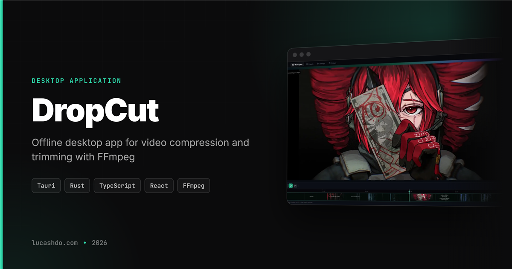

<p align="center">
  
</p>

# DropCut

DropCut is a local Windows video compressor and trimmer built with Tauri, React, and FFmpeg.

## Download

Download the latest Windows build from GitHub Releases:

https://github.com/LucasHenriqueDiniz/dropcut/releases/latest

## Features

- Compress videos locally with built-in FFmpeg.
- Trim clips before exporting.
- Use Discord-ready presets.
- Process files offline with no account or telemetry.
- Add Windows Explorer context menu shortcuts.

## Development

```bash
npm install
npm run tauri dev
```

## Release

Pushing a `v*` tag runs the GitHub Actions release workflow and publishes Windows installers.

```bash
git tag v0.1.2
git push origin v0.1.2
```
